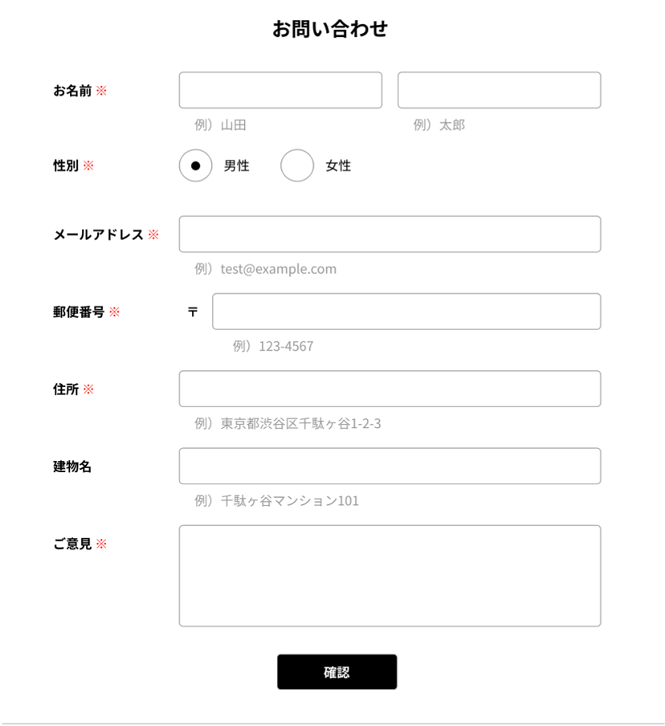

# 問い合わせフォーム
ユーザーからの問い合わせを受け付け、管理するアプリ

## 作成した目的/概要説明
問い合わせフォームより登録されたユーザー情報を、顧客管理画面にて検索/削除が可能

# アプリケーションURL デプロイのURLを貼り付る
ログインなどがあれば、注意事項など ※デプロイしていなければ記載しなくて良い

# #機能一覽
- 例 ) ロ グ イン 機 能

# 使用技術(実行環境)
- 例)Laravel8.x(言語やフレームワーク、バージョンなどが記載されていると良い)

# テーブル設計
<-- -作成したテーブル設計の画像---->

# ER図 <---作成したER図の画像- -- >-

# 他 に記載することがあれば 記述する
例)# 環境構築、## アカウントの種類(テストユーザーなど)
