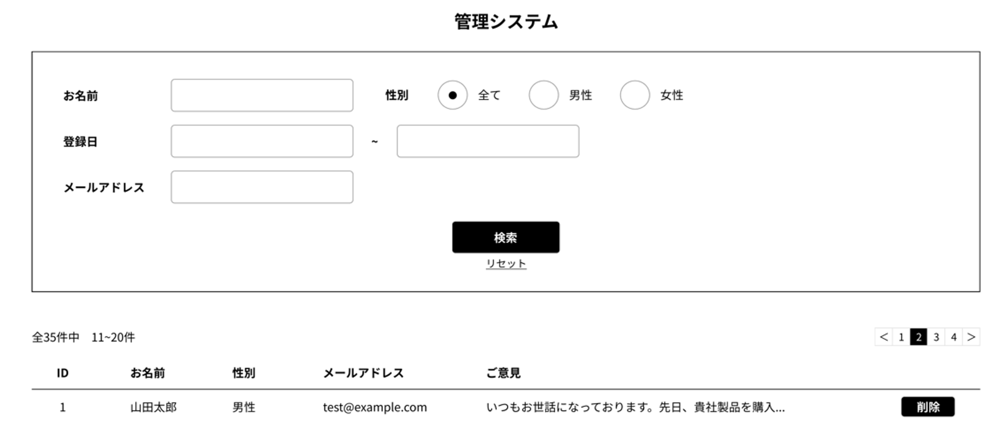
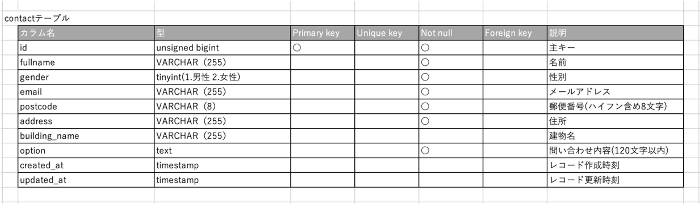

# 問い合わせフォーム

ユーザーからの問い合わせを受け付け、管理するアプリ

## 作成した目的
問い合わせフォームより登録されたユーザー情報を、顧客管理画面にて検索/削除するため

## 機能一覽
問い合わせフォーム
- 顧客情報/問い合わせ内容入力、確認、送信機能
  
顧客管理画面
- 顧客情報/問い合わせ内容検索機能
- 顧客情報/問い合わせ内容削除機能

## 使用技術(実行環境)
- Laravel8.7.5
- JavaScript
- php7.4.9

## テーブル設計

## ER図

##  環境構築
1.  リポジトリの設定(以下をクローン)

        git@github.com:YukikoTK/first_test.git

2.  Docker の設定(開発環境構築)

        $ docker-compose up -d --build

3.  Laravel のパッケージのインストール

- PHP コンテナにログイン

      $ docker-compose exec php bash

- パッケージのインストール

      $ composer install

4.  .env ファイルの作成

      $ cp src/.env.example .env

    作成した.envファイルはsrcディレクトリに保存

5.  以下の通り.env ファイルの修正

        DB_CONNECTION=mysql

        DB_HOST=mysql

        DB_PORT=3306

        DB_DATABASE=laravel_db

        DB_USERNAME=laravel_user

        DB_PASSWORD=laravel_pass

6.  アプリケーションを起動するためのキーを生成

        php artisan key:generate