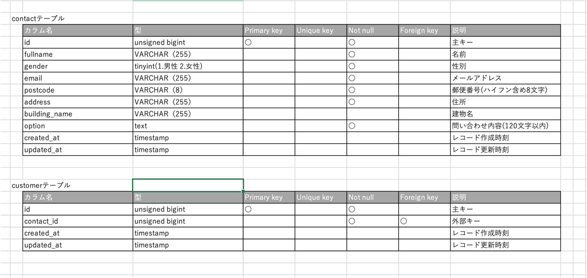
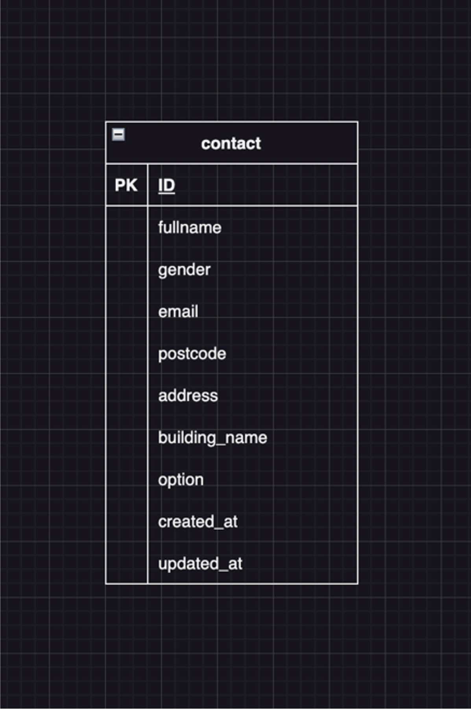

# アプリケーション名
「問い合わせフォーム」

ユーザーからの問い合わせを受け付け、管理するアプリ

## 作成した目的
問い合わせフォームより登録されたユーザー情報を、顧客管理画面にて検索/削除するため

## 機能一覽
問い合わせフォーム
- 顧客情報/問い合わせ内容入力、確認、送信機能
  
顧客管理画面
- 顧客情報/問い合わせ内容検索機能
- 顧客情報/問い合わせ内容削除機能

# 使用技術(実行環境)
- Laravel8.7.5
- JavaScript
- php

# テーブル設計

# ER図

